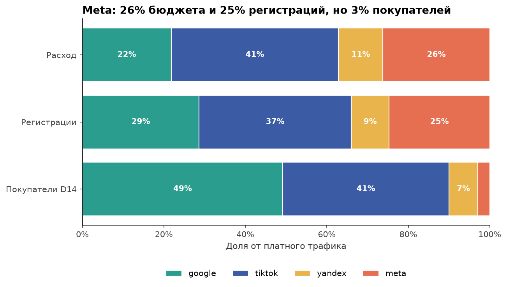
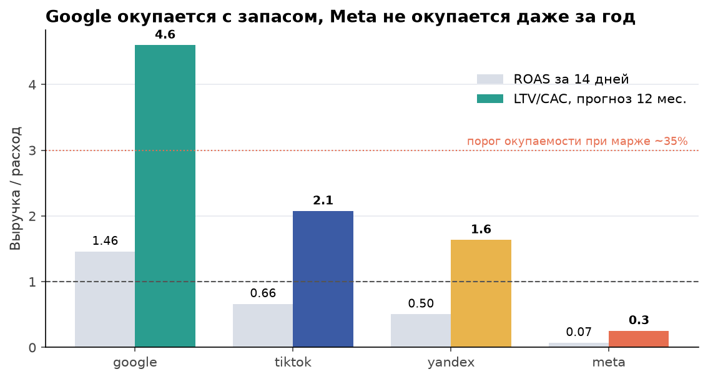

# 01. Юнит-экономика рекламных каналов

## Задача

Маркетинг тратит около $10 тыс. в месяц на четыре платформы: TikTok, Google, Meta, Yandex. Нужно понять, какие из них приводят покупателей по нормальной цене, и предложить, куда переложить бюджет на следующий месяц. Отдельный вопрос: есть ли разница между iOS и Android.

## Данные

| Таблица | Что внутри |
|---|---|
| `ad_spend` | расход, показы, клики, установки по дням, платформе и ОС, июль-август 2026 |
| `users` | регистрации: дата, ОС, источник (`media_source`), страна |
| `orders` | заказы (посылки): дата, цена доставки, статус оплаты |

Когорта: 8 185 регистраций с 1 июля по 31 августа 2026, из них 6 636 с платных платформ. Расход за два месяца $19 791.

## Метод

- **Окно покупки 14 дней от регистрации.** Если считать покупки "до сегодня", июльские регистрации получают на полтора месяца больше времени, чем августовские, и сравнение платформ зависит от того, когда в каком месяце крутилась реклама.
- **Выручка** = стоимость доставки по заказам со статусом 1 или 2 (оплачен или ждёт оплаты при получении), без отмен. Про статусы см. [кейс 5](../05_data_quality_traps).
- Метрики: CPI = расход / установки, CPR = расход / регистрации, CR = покупатели / регистрации, CAC = расход / покупатели, ROAS D14 = выручка 14 дней / расход.
- **LTV/CAC.** За два месяца годовой LTV не накопится. Прогноз: выручка когорты за 14 дней x коэффициент "выручка 365 дней / выручка 14 дней", посчитанный по регистрациям 09.2024-08.2025 той же платформы (коэффициенты 3.1-3.5). LTV/CAC = прогноз выручки за 12 месяцев на регистрацию / CPR.
- Все метрики по платформе, по платформе x ОС и итог считаются одним запросом через `GROUPING SETS` ([queries.sql](queries.sql), запрос `unit_economics`).

## Результат

| Платформа | Расход | Регистрации | CPI | CPR | CR 14 дней | CAC | ROAS 14 дней | LTV/CAC, 12 мес. |
|---|---:|---:|---:|---:|---:|---:|---:|---:|
| Google | $4 312 | 1 901 | $1.41 | $2.27 | 19.4% | **$12** | **1.46** | **4.6** |
| TikTok | $8 131 | 2 478 | $1.79 | $3.28 | 12.3% | $27 | 0.66 | 2.1 |
| Yandex | $2 154 | 617 | $1.74 | $3.49 | 8.6% | $41 | 0.50 | 1.6 |
| Meta | $5 194 | 1 640 | $1.83 | $3.17 | **1.3%** | **$236** | 0.07 | **0.25** |
| Organic | - | 1 549 | - | - | 16.7% | - | - | - |
| Итого платные | $19 791 | 6 636 | $1.70 | $2.98 | 11.3% | $26 | 0.66 | |

1. **Meta приводит регистрации, но не покупателей.** 26% бюджета и 25% платных регистраций, но 3% покупателей. CR 1.3% против 12-19% у Google и TikTok, CAC $236. Не окупается даже на годовом горизонте (LTV/CAC 0.25). По CPI и CPR Meta выглядит нормально, поэтому в отчёте "по установкам" проблему не видно.
2. **Google самый дешёвый и самый окупаемый.** CAC $12, ROAS за 14 дней уже 1.46, прогнозный LTV/CAC 4.6. Google первый по CR среди платных платформ 8 недель из 9.
3. **iOS конвертирует в 2.0 раза лучше Android**: CR 18.3% против 9.1%. Разница есть внутри каждой платформы, кроме Meta. Регистрация на iOS дороже ($3.58 против $2.67), но покупатель дешевле: CAC $22 против $31.





Остальные графики: [CR и CAC по платформам](charts/02_cr_cac_by_platform.png), [iOS против Android](charts/04_cr_ios_android.png), [CR по неделям](charts/05_weekly_cr.png), [сценарий перераспределения](charts/06_reallocation.png).

## Рекомендации

1. **Сократить Meta на 80%** (минус $4 155 за два месяца). Оставшиеся 20% отдать на тест ретаргетинга по тем, кто уже зарегистрировался: холодный трафик Meta не покупает.
2. **Переложить высвобожденные деньги в Google (60%) и TikTok (40%).** Даже если у дополнительного бюджета CAC будет на 30% выше текущего, на тот же бюджет получаем 942 покупателя вместо 748, **+26%**.
3. **В Google и TikTok поднять ставки на iOS.** Дорогая регистрация на iOS окупается конверсией: CAC на iOS в Google $8.9 против $15.1 на Android.
4. **Yandex оставить на текущем уровне и не расширять.** LTV/CAC 1.6: на выручке окупается, но при марже около 35% (порог LTV/CAC около 3) нет.
5. **Оценивать платформы по CAC и LTV/CAC, а не по CPI.** По цене установки Meta в одном ряду с остальными.

## ClickHouse-вариант ключевого запроса

В рабочем хранилище этот расчёт шёл в ClickHouse. Главные отличия: `countIf`/`sumIf` вместо `FILTER`, а окно в 14 дней стоит внутри `countIf`/`sumIf`, а не в `ON`: неравенства в условии джойна ClickHouse поддерживает не во всех версиях и не для всех алгоритмов джойна.

```sql
WITH cohort AS (
    SELECT user_id, media_source AS platform, os, registered_at
    FROM users
    WHERE registered_at >= '2026-07-01' AND registered_at < '2026-09-01'
),
per_user AS (
    SELECT c.platform, c.os, c.user_id,
           countIf(o.order_id != 0
                   AND o.created_at >= c.registered_at
                   AND o.created_at < c.registered_at + INTERVAL 14 DAY) > 0          AS is_buyer,
           sumIf(o.price, o.created_at >= c.registered_at
                          AND o.created_at < c.registered_at + INTERVAL 14 DAY)       AS revenue
    FROM cohort AS c
    LEFT JOIN (SELECT user_id, order_id, created_at, price
               FROM orders FINAL
               WHERE payment_status IN (1, 2)) AS o ON o.user_id = c.user_id
    GROUP BY c.platform, c.os, c.user_id
)
SELECT platform, os,
       count()            AS regs,
       countIf(is_buyer)  AS buyers,
       sum(revenue)       AS revenue_d14
FROM per_user
GROUP BY GROUPING SETS ((platform), (platform, os), ())
SETTINGS join_use_nulls = 0;
```

`FINAL` нужен, потому что таблица заказов в ClickHouse хранит версии строк (см. [кейс 5](../05_data_quality_traps)). `join_use_nulls = 0` явно: при `1` у пользователей без заказов `o.order_id` станет `NULL`, и условие `!= 0` поведёт себя иначе.

## Как воспроизвести

```bash
python data_gen/generate.py
cd 01_unit_economics_channels
jupyter nbconvert --to notebook --execute --inplace analysis.ipynb
```

Файлы: [analysis.ipynb](analysis.ipynb) (ноутбук с выводами), [queries.sql](queries.sql) (SQL, DuckDB), [results.json](results.json) (ключевые числа, из них собрана таблица выше), `charts/` (графики).
