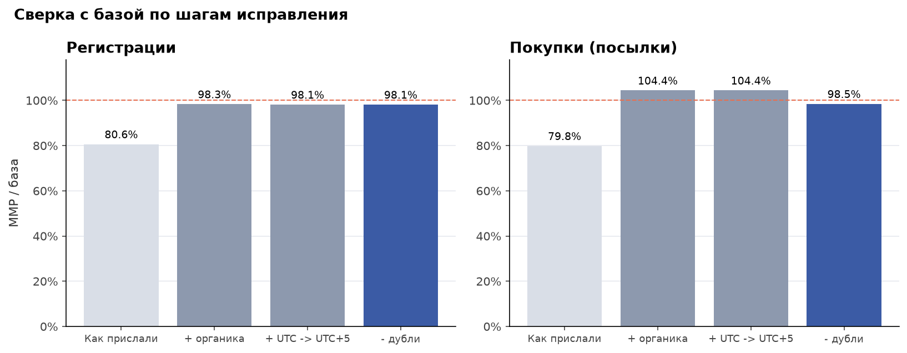
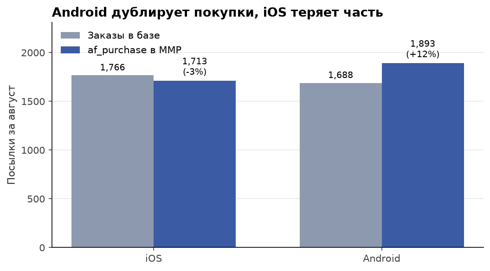
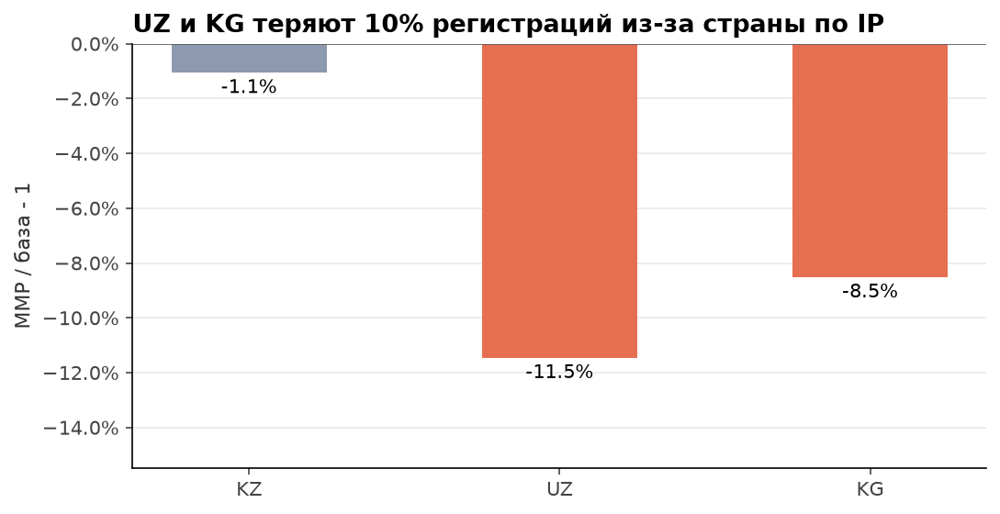

# 02. Аудит атрибуции: MMP против внутренней базы

## Задача

Маркетинг смотрит регистрации и покупки в MMP (сервис мобильной атрибуции, аналог AppsFlyer), продукт смотрит в базу. За август в MMP на 19% меньше регистраций и на 20% меньше покупок. Нужно понять, можно ли доверять MMP, откуда разница, и что исправить разработчикам и аналитикам.

## Данные

| Таблица | Что внутри | Время |
|---|---|---|
| `users`, `orders` | внутренняя база: регистрации и заказы (посылки) | UTC+5 (Алматы) |
| `mmp_events_nonorganic` | сырые события MMP по атрибутированным установкам | UTC |
| `mmp_events_organic` | сырые события MMP по органике, отдельный отчёт | UTC |

События: `af_complete_registration` и `af_purchase`. В событии есть `customer_user_id` (id пользователя, строка), платформа, страна по IP, источник, `order_id` и сумма для покупок. Период: август 2026, 4 131 регистрация и 3 454 посылки в базе.

## Метод

1. Первая сверка "в лоб": август по календарю каждой системы, только неорганический отчёт.
2. Единая таблица событий MMP ([queries.sql](queries.sql), запрос `mmp_clean`): оба отчёта, `customer_user_id` очищен (`TRY_CAST(NULLIF(TRIM(...), '') AS BIGINT)` снимает пробелы и ведущие нули), время переведено в UTC+5, повторы помечены через `ROW_NUMBER()`.
3. **Покрытие по id**: доля пользователей базы, у которых есть хоть одно событие в MMP. Это главная метрика: она не зависит от часовых поясов и дублей.
4. Покупки матчатся с заказами по `order_id` и сумме: `order_id` не уникален между каналами доставки (см. [кейс 5](../05_data_quality_traps)).
5. Гео: для пользователей, найденных в обеих системах, сравниваем страну из базы и страну по IP из MMP.

## Результат

**MMP покрывает 97.3% пользователей базы по id.** Платные платформы 96-98%, органика 96.5%. Разница в отчётах почти целиком объясняется выгрузкой и обработкой, а не потерями трекинга.

| Шаг | Регистрации MMP / база | Покупки MMP / база |
|---|---:|---:|
| Как прислали: неорганика, август по UTC | 80.6% | 79.8% |
| + отчёт по органике | 98.3% | 104.4% |
| + время UTC -> UTC+5 | 98.1% | 104.4% |
| - повторные события | **98.1%** | **98.5%** |



**Причины расхождений:**

| Причина | Что видно | Влияние, август |
|---|---|---|
| Не выгружен отчёт по органике | в MMP нет органических пользователей | покрытие по id 80% -> 97% |
| UTC против UTC+5 | события с 00:00 до 05:00 по Алматы попадают в предыдущий день | 4.9% событий меняют дату, дневная ошибка регистраций 3.1% -> 1.9%; за месяц в целом сдвиг почти гасится |
| Формат `customer_user_id` | пустой id до логина (1.2%), ведущие нули и пробел (1.5%) | строковый матч теряет 2.7% событий |
| Повторная отправка на Android | одна покупка приходит дважды с разницей в секунды | Android завышен на 12% |
| Потери на iOS | часть покупок не доходит до MMP | iOS занижен на 3% |
| Страна по IP | поездки и VPN | в отчёте по странам UZ -11.5%, KG -8.5%, KZ -1.1% |

Ошибки по ОС гасят друг друга: в сумме покупок MMP "почти сходится" с базой, хотя на Android +12%, а на iOS -3%.



**Гео.** По id покрытие в UZ (97.4%) и KG (99.1%) не хуже, чем в KZ (97.1%). Значит, пользователи не теряются, их просто относят к другой стране: 8-12% пользователей из UZ и KG MMP показывает в Турции, России, ОАЭ, Германии или Польше. Отчёт MMP по странам занижает UZ и KG примерно на 10%.



Ещё графики: [покрытие по id](charts/01_coverage_by_user.png), [сдвиг по часам](charts/02_hourly_shift.png).

## Рекомендации

**Аналитикам:**
1. Выгружать из MMP оба отчёта (неорганика и органика) и сразу переводить время в UTC+5.
2. Сверять по покрытию id, а не по суммам событий: суммы прячут дубли и потери за взаимным погашением.
3. Страну для отчётов брать из базы через id пользователя, а не из IP в MMP.
4. Покупки считать по базе, в MMP смотреть только атрибуцию.

**Чек-лист для разработчиков:**
- [ ] Вызывать `setCustomerUserId` сразу после логина или регистрации, до отправки первого события.
- [ ] Передавать id в том же формате, что в базе: только цифры, без ведущих нулей и пробелов.
- [ ] Android: не отправлять повторно `af_purchase` с уже отправленным `order_id` (ретрай SDK при плохой сети).
- [ ] iOS: отправлять `af_purchase` после подтверждения заказа сервером, а не при закрытии экрана.
- [ ] В `af_purchase` всегда передавать `order_id` и сумму: без них сверку по заказам не сделать.

## Как воспроизвести

```bash
python data_gen/generate.py
cd 02_attribution_audit
jupyter nbconvert --to notebook --execute --inplace analysis.ipynb
```

Файлы: [analysis.ipynb](analysis.ipynb), [queries.sql](queries.sql), [results.json](results.json), `charts/`.
