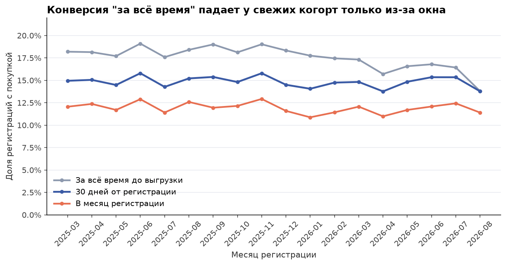
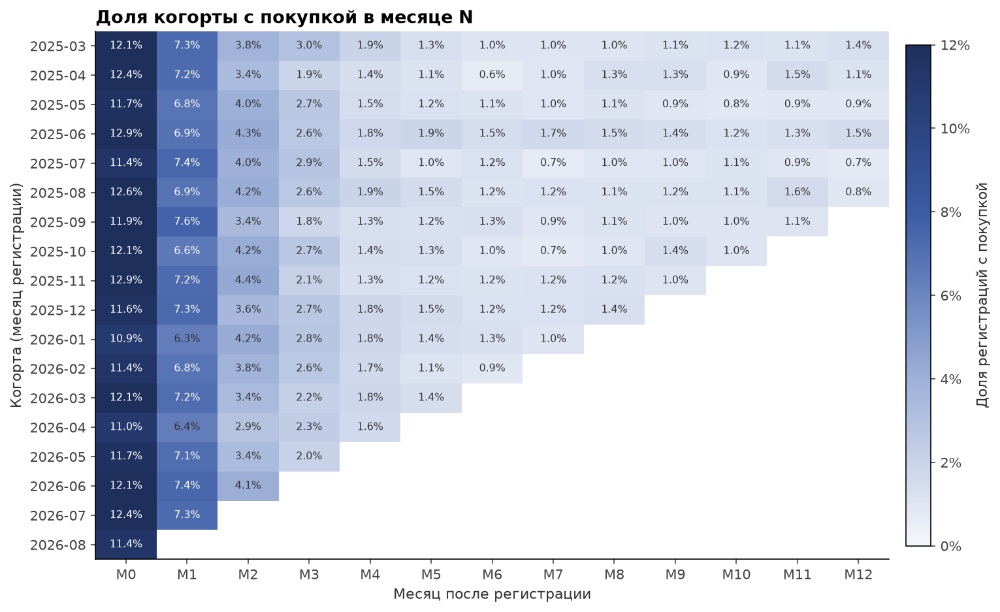
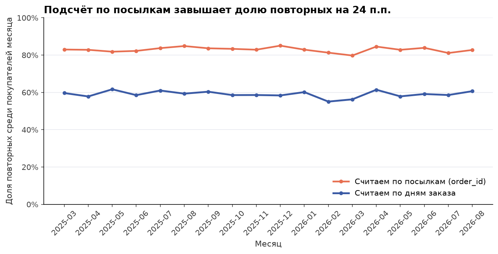
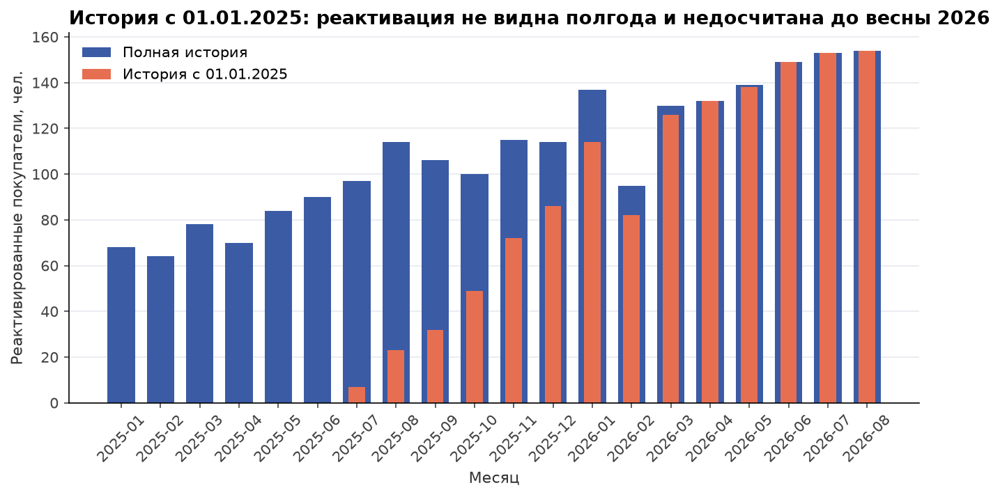

# 03. Когорты, повторные покупки и реактивация

## Задача

Три вопроса от продукта и маркетинга:
1. Какая доля регистраций доходит до первой покупки.
2. Сколько покупателей возвращается в следующие месяцы.
3. Сколько покупателей возвращается после долгой паузы (180+ дней) и можно ли считать это по хранилищу.

## Данные

- `users`: регистрации, когорты 03.2025-08.2026 (56 152 регистрации).
- `orders`: заказы без отмен (статусы 1 и 2), вся история с 2023 года.

**Покупка = уникальный день заказа пользователя.** Одна покупка на маркетплейсе приезжает несколькими посылками, у каждой свой `order_id`: в среднем 1.88 посылки на покупку, у 58% покупок посылок две и больше. Поэтому сначала строится таблица `purchase_days` (пользователь x день), и все метрики считаются от неё.

## Метод

- **Конверсия в первую покупку** в трёх окнах: в месяц регистрации, 30 дней от регистрации, всё время до даты выгрузки.
- **Когортная матрица**: доля когорты с покупкой в месяце N после регистрации, M0-M12. Сентябрь 2026 неполный и не входит.
- **Повторный покупатель месяца**: покупал в этом месяце и имел покупку в более ранний день. Сравниваем с наивным подсчётом, где повтором считается любая более ранняя посылка.
- **Реактивация**: покупка, перед которой пауза 180+ дней (`LAG(order_day)` по пользователю). Считаем дважды: по полной истории и по истории, обрезанной с 01.01.2025, как бывает после миграции хранилища.

SQL: [queries.sql](queries.sql).

## Результат

**1. Конверсия зависит от окна сильнее, чем от когорты.**

| Окно | Конверсия в первую покупку |
|---|---:|
| В месяц регистрации | 11.9% |
| 30 дней от регистрации | 14.8% |
| Всё время (когорты 03-08.2025, 12+ месяцев истории) | 18.2% |
| Всё время, когорта 08.2026 (44 дня истории) | 13.8% |

"Конверсия за всё время" падает у свежих когорт только потому, что у них было меньше времени. Сравнивать когорты можно по фиксированному окну (30 дней), а "месяц регистрации" наказывает тех, кто зарегистрировался в конце месяца.



**2. Удержание.** В среднем по когортам покупку в месяце регистрации делают 11.9% регистраций, в следующем месяце 7.1%, на третий месяц 2.5%, на шестой и двенадцатый около 1.1%. Хвост после M6 почти плоский: это покупатели, которые возвращаются после долгих пауз.



**3. Посылки против дней.** Если считать повтором любую более раннюю посылку, доля повторных среди покупателей месяца 83%. По дням заказа 59%. Разница 24 п.п. целиком из посылок одной покупки.



**4. Реактивация и глубина истории.** По полной истории 9.8% покупателей месяца в 2026 году вернулись после паузы 180+ дней. Паузы у них длинные: медиана 300 дней, 95-й перцентиль 433 дня. Если в хранилище заказы только с 01.01.2025:

| Период | Недосчёт реактивации |
|---|---:|
| 01-06.2025 | 100% (метрика равна нулю) |
| 07-12.2025 | 58% |
| 01-08.2026 | 4% |

Вернувшиеся после паузы в первом полугодии 2025 при этом записываются в новые покупатели: "новых" на 36% больше, чем на самом деле. Глубина истории должна покрывать самые длинные паузы: при p95 = 433 дня это около 15 месяцев до начала отчётного периода. Здесь недосчёт исчезает как раз к марту-апрелю 2026.



## Рекомендации

1. **Все метрики покупок считать по дням заказа**, а не по `order_id`. Завести в хранилище витрину `purchase_days` и строить отчёты от неё.
2. **Конверсию когорт сравнивать в фиксированном окне** (7 или 30 дней от регистрации). Конверсию "за всё время" показывать только для когорт, у которых окно уже закрылось.
3. **Перед расчётом реактивации проверять глубину истории**: минимальная дата заказа в таблице должна быть раньше начала периода хотя бы на p95 паузы между покупками (здесь 433 дня). Иначе отчёт показывает рост реактивации, который на самом деле рост видимости.
4. Хвост удержания после M6 около 1% в месяц стабилен: это аудитория для реактивационных кампаний на 150-450-й день после последней покупки.

## ClickHouse-вариант

Покупки по дням и реактивация. В ClickHouse нет `LAG`, используется `lagInFrame` с явной рамкой окна. Для пользователя без предыдущей покупки `lagInFrame` возвращает не `NULL`, а значение по умолчанию (`1970-01-01`), поэтому первую покупку отсекаем отдельно.

```sql
WITH purchase_days AS (
    SELECT user_id, toDate(created_at) AS order_day
    FROM orders FINAL
    WHERE payment_status IN (1, 2)
    GROUP BY user_id, order_day
),
d AS (
    SELECT user_id, order_day,
           lagInFrame(order_day) OVER (PARTITION BY user_id ORDER BY order_day
                                       ROWS BETWEEN 1 PRECEDING AND CURRENT ROW) AS prev_day,
           row_number() OVER (PARTITION BY user_id ORDER BY order_day)            AS rn
    FROM purchase_days
)
SELECT toStartOfMonth(order_day)                                        AS month,
       uniqExact(user_id)                                               AS buyers,
       uniqExactIf(user_id, rn = 1)                                     AS new_buyers,
       uniqExactIf(user_id, rn > 1 AND dateDiff('day', prev_day, order_day) >= 180) AS reactivated
FROM d
WHERE order_day >= '2025-01-01' AND order_day < '2026-09-01'
GROUP BY month
ORDER BY month;
```

## Как воспроизвести

```bash
python data_gen/generate.py
cd 03_cohorts_retention_reactivation
jupyter nbconvert --to notebook --execute --inplace analysis.ipynb
```

Файлы: [analysis.ipynb](analysis.ipynb), [queries.sql](queries.sql), [results.json](results.json), `charts/`.
