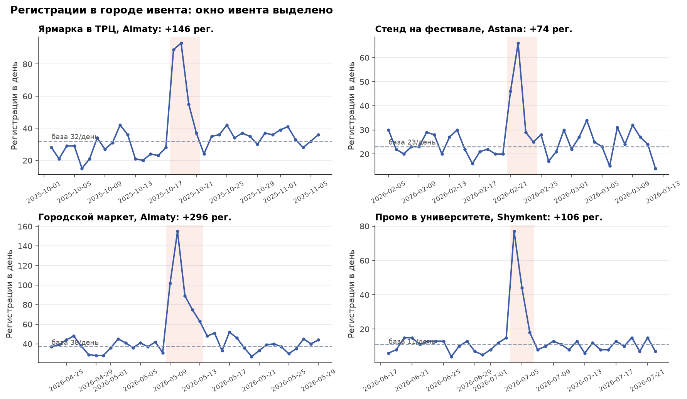
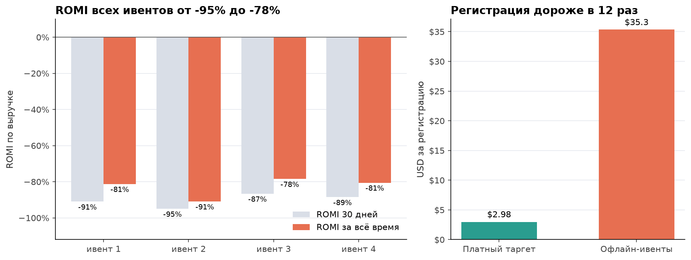
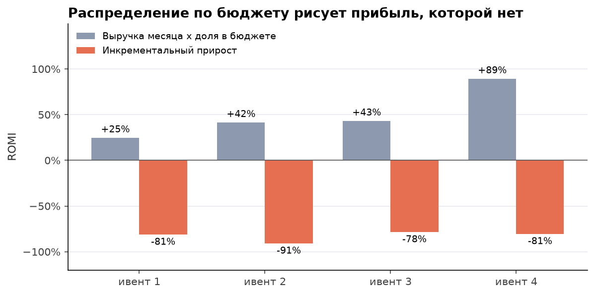

# 04. ROMI офлайн-ивентов без трекинга лидов

## Задача

За год прошло 4 офлайн-ивента (ярмарка, стенд на фестивале, городской маркет, промо в университете) на $22 000. Нужно ответить, окупились ли они и продолжать ли.

Сложность: у ивентов не было промокода, отдельной ссылки или QR с меткой. Пришедшие с ивента пользователи лежат в базе как `organic`, отличить их от обычной органики нельзя.

## Данные

- `offline_events`: даты, город, бюджет ивента.
- `users`: регистрации по дням и городам.
- `orders`: выручка (стоимость доставки) по заказам.
- `marketing_budget`: маркетинговый бюджет по месяцам, для разбора альтернативного "метода".
- `ad_spend`: для сравнения с ценой регистрации в платном таргете.

## Метод

Инкрементальный прирост регистраций в городе ивента:

1. **Окно ивента** = дни ивента + 2 дня хвоста (люди регистрируются не сразу).
2. **База** = медиана дневных регистраций в этом городе за 14 дней до и 14 дней после окна, без самих дней окна. Медиана, а не среднее: один случайный всплеск не сдвигает базу.
3. **Прирост** = регистрации в окне - база x число дней окна.
4. **Проверка на шум**: тот же расчёт на 277 плацебо-окнах без ивентов для каждого города.
5. **Инкрементальная выручка** = прирост x ARPU обычной регистрации того же города в базовые дни (30 дней и всё время до выгрузки).
6. **ROMI** = (инкрементальная выручка - затраты) / затраты. **CPR** = затраты / прирост.

SQL: [queries.sql](queries.sql), запросы `event_uplift` и `baseline_arpu`.

## Результат

| Ивент | Город | Затраты | Прирост регистраций | CPR | ROMI 30 дней | ROMI всё время |
|---|---|---:|---:|---:|---:|---:|
| Ярмарка в ТРЦ, 10.2025 | Almaty | $6 000 | +146 | $41.1 | -91% | -81% |
| Стенд на фестивале, 02.2026 | Astana | $4 500 | +74 | $60.8 | -95% | -91% |
| Городской маркет, 05.2026 | Almaty | $8 000 | +297 | $27.0 | -87% | -78% |
| Промо в университете, 07.2026 | Shymkent | $3 500 | +106 | $33.0 | -89% | -81% |
| **Итого** | | **$22 000** | **+623** | **$35.3** | **-90%** | **-82%** |

1. **Прирост реальный.** Ни одно из плацебо-окон не дало прироста, равного приросту на ивентах: у плацебо 90% значений лежат в пределах ±25 регистраций, у ивентов +74...+297.
2. **Регистрация с ивента стоит $35.3 против $2.98 в платном таргете, в 12 раз дороже.**
3. **ROMI всех ивентов от -78% до -95%.** Выручка покрывает 9-22% затрат. Для выхода в ноль прирост нужен в 5-11 раз больше.





**Почему "выручка месяца x доля в бюджете" не измерение.** Предлагали посчитать так: выручка месяца, умноженная на долю ивента в маркетинговом бюджете месяца. Такой расчёт даёт ROMI от +25% до +89%, то есть все ивенты "прибыльные". Но он вообще не смотрит на результат ивента: выручка распределяется пропорционально затратам, и чем больше потратили, тем больше "заработали". Проверка: вымышленный ивент за $5 000 в марте 2026, который не дал ни одной дополнительной регистрации (прирост 0), получает по этому методу ROMI +56%.



Ещё график: [плацебо-проверка](charts/02_placebo.png).

**Ограничения, и все в пользу ивентов:**
- медиана соседних дней не учитывает день недели, а ивенты шли в выходные, когда регистраций и так больше;
- ARPU взят у обычных регистраций, у пришедших за подарком на стенде он обычно ниже;
- ROMI по выручке, а не по марже;
- у последнего ивента (07.2026) всего 72 дня истории, его ROMI за всё время ещё вырастет, но не до нуля: годовая выручка регистрации примерно в 3 раза больше 14-дневной ([кейс 1](../01_unit_economics_channels)), а для выхода в ноль выручку ивента нужно увеличить в 5 раз.

## Рекомендации

1. **Не продолжать ивенты в текущем формате как канал привлечения.** На те же $22 000 в платном таргете по текущему CPR было бы около 7 400 регистраций вместо 623.
2. **Если ивенты нужны для бренда**, мерить их отдельно (узнаваемость, брендовый поиск), а не приписывать им выручку месяца.
3. **Каждый следующий ивент запускать с трекингом**: промокод или QR со своей меткой, регистрация на месте через ссылку с параметрами. Тогда можно посчитать не только прирост, но и качество пришедших.
4. **Не использовать распределение выручки по доле бюджета** ни для одного канала: это распределение затрат, а не результата.

## Как воспроизвести

```bash
python data_gen/generate.py
cd 04_offline_events_romi
jupyter nbconvert --to notebook --execute --inplace analysis.ipynb
```

Файлы: [analysis.ipynb](analysis.ipynb), [queries.sql](queries.sql), [results.json](results.json), `charts/`.
