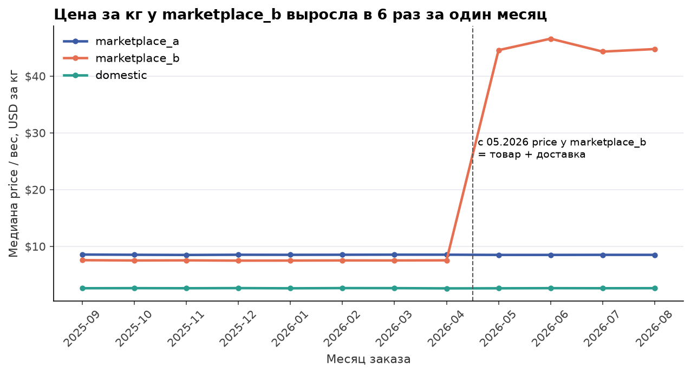
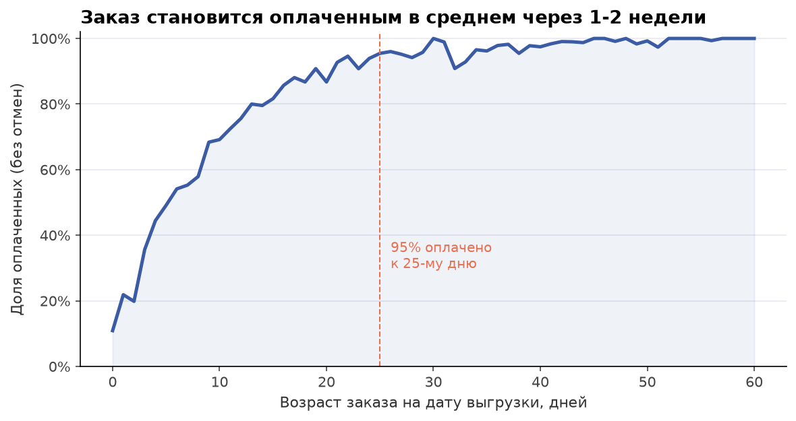

# 05. Ловушки качества данных в таблице заказов

## Задача

Короткий кейс про три ошибки, которые уже попадали в отчёты по выручке. Для каждой: как её заметить, как исправить, и какая автоматическая проверка поймает её в следующий раз.

## Данные

- `orders_raw`: таблица заказов как в хранилище. Хранит версии строк (новая строка на каждое изменение заказа, как ReplacingMergeTree в ClickHouse до слияния), с мая 2026 у канала `marketplace_b` в поле `price` пишется сумма товара вместе с доставкой.
- `orders`: очищенная витрина, с которой работают кейсы 1-4.
- `users`: для проверок связности.

## Метод

1. **Дедупликация** по ключу `(created_at, order_id)`, последняя версия по `updated_at`:
   ```sql
   SELECT *
   FROM orders_raw
   QUALIFY ROW_NUMBER() OVER (PARTITION BY created_at, order_id ORDER BY updated_at DESC) = 1
   ```
2. **Смена смысла поля**: медиана `price / weight_kg` по каналу и месяцу. Тарифы не меняются в разы за месяц, поэтому скачок в разы = изменилось поле, а не бизнес.
3. **Статус оплаты**: доля оплаченных по возрасту заказа.
4. **Проверки в стиле тестов**: [checks.sql](checks.sql) (8 проверок, каждая возвращает число нарушений) и [run_checks.py](run_checks.py) (прогон, код выхода 1 при нарушениях). SQL разбора: [queries.sql](queries.sql).

## Результат

**1. Версии строк.** В `orders_raw` 81 915 строк на 72 240 заказов: 9 675 лишних версий (13.4%). Без дедупликации выручка завышена на 13.6%, число заказов на 13.9%.

Две ошибки, которые встречаются чаще, чем кажется:
- **Дедуп только по `order_id`** теряет 1 500 реальных заказов (2.1%): у канала `domestic` свой счётчик номеров, и его первые номера совпадают с номерами маркетплейсов. Поэтому ключ `(created_at, order_id)`.
- **Фильтр по статусу до дедупа.** `WHERE payment_status = 1` до выбора последней версии даёт 7 468 "неоплаченных" заказов вместо 1 257, в 6 раз больше: в выборку попадают старые версии давно оплаченных заказов. Сначала дедуп, потом фильтр.

**2. Поле price поменяло смысл.** С мая 2026 медиана цены за кг у `marketplace_b` выросла в 6 раз ($7.5 -> $45 за кг), у других каналов не изменилась. Доля канала в выручке по сырому `price` выросла с 31% до 72%, а по числу заказов осталась 30%. Общая выручка с мая по сырому полю завышена на 148%.



**3. Статус оплаты.** Доставка оплачивается при получении, поэтому `payment_status = 1` значит "ещё не оплачен", а не "отменён". 95% заказов оплачено к 25-му дню после заказа. На дату выгрузки (14.09.2026) по августу оплачено 93% выручки к получению, по сентябрю 50%. Сравнивать оплаченную выручку текущего месяца с закрытыми месяцами нельзя.

| Статус | Значение | В выручку |
|---|---|---|
| 2 | оплачен | да |
| 1 | ждёт оплаты при получении | в выручку к получению, для незакрытых месяцев |
| 0 | отмена или тестовый заказ | нет |



**4. Проверки.**

| Проверка | Сырая таблица | После дедупа | Витрина |
|---|---:|---:|---:|
| `unique_key`: ключ (created_at, order_id) уникален | 9 675 | 0 | 0 |
| `status_domain`: статус только 0, 1, 2 | 0 | 0 | 0 |
| `price_positive`: цена > 0 | 0 | 0 | 0 |
| `updated_after_created`: версия не старше заказа | 0 | 0 | 0 |
| `user_exists`: у заказа есть пользователь | 0 | 0 | 0 |
| `order_after_registration`: заказ не раньше регистрации | 0 | 0 | 0 |
| `price_per_kg_stable`: цена за кг не прыгает больше 50% к трём прошлым месяцам | 2 | 2 | 0 |
| `closed_month_paid`: в закрытых месяцах неоплаченных меньше 2% | 43 | 0 | 0 |

Сырая таблица проваливает 3 проверки из 8, витрина проходит все. В ноутбуке это зафиксировано через `assert`: и то, что витрина чистая, и то, что проверки действительно ловят сырые данные.

## Рекомендации

1. Выручку считать только от дедуплицированной таблицы по ключу `(created_at, order_id)`. В ClickHouse: `FINAL` или `argMax(..., updated_at)`, см. ниже.
2. Вес канала, пока поле `price` у `marketplace_b` не исправлено в источнике, считать по числу заказов. Стоимость доставки брать из биллинга.
3. Для закрытых месяцев выручка = `SUM(price) WHERE payment_status = 2`. Для текущего месяца и прошлого, если с его конца прошло меньше ~25 дней, показывать выручку к получению (статусы 1 и 2) и долю уже оплаченной.
4. Запускать `run_checks.py` перед каждым обновлением отчёта. Проверка на скачок цены за кг поймала бы смену поля в первом же месяце.

## ClickHouse-вариант дедупликации

```sql
-- 1) FINAL: движок сам схлопывает версии по ключу сортировки (created_at, order_id)
SELECT toStartOfMonth(created_at) AS month, sumIf(price, payment_status = 2) AS revenue
FROM orders FINAL
GROUP BY month;

-- 2) без FINAL: последняя версия через argMax, работает и на обычном MergeTree
SELECT toStartOfMonth(created_at) AS month, sumIf(price, status = 2) AS revenue
FROM (
    SELECT created_at, order_id,
           argMax(price, updated_at)          AS price,
           argMax(payment_status, updated_at) AS status
    FROM orders
    GROUP BY created_at, order_id
)
GROUP BY month;
```

Фильтр по статусу стоит снаружи подзапроса, после выбора последней версии. `WHERE payment_status = 2` внутри подзапроса повторит ошибку "фильтр до дедупа". На большой таблице вариант с `GROUP BY (created_at, order_id)` потоковый и укладывается в память лучше, чем `ROW_NUMBER()` по всей истории.

## Как воспроизвести

```bash
python data_gen/generate.py
python 05_data_quality_traps/run_checks.py             # витрина: 8 из 8
python 05_data_quality_traps/run_checks.py orders_raw  # сырая: 5 из 8, код выхода 1
cd 05_data_quality_traps
jupyter nbconvert --to notebook --execute --inplace analysis.ipynb
```

Файлы: [analysis.ipynb](analysis.ipynb), [queries.sql](queries.sql), [checks.sql](checks.sql), [run_checks.py](run_checks.py), [results.json](results.json), `charts/`.
